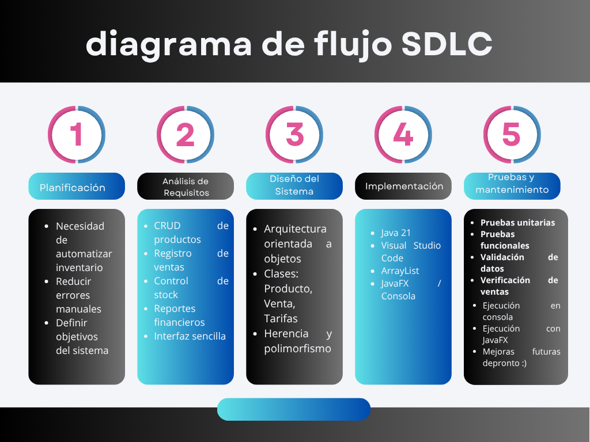

# progrmacion_parcial_final
# 📦 Sistema de Inventario SAMADIGITAL

## 👥 Integrantes

| Nombre                            | Rol                                            |codigo
|--------|--------------------------|------------------------------------------------|--------|
| yeraldin vega garcia              | Desarrollador de Inventario e Interfaz Gráfica |192760
|--------|------- ------------------|------------------------------------------------|--------|
| ANDREA DEL PILAR RUEDAS RODRÍGUEZ | Analista y desarrolladora de Productos         |0192756
|--------|------- ------------------|------------------------------------------------|--------|
| miguel angel caro                 | Desarrollador de Ventas y Reportes             |0192766
|--------|------- ------------------|------------------------------------------------|--------|
| Jan Franco Quintero Parada        | Desarrollador de Tarifas e Interfaz de Usuario |0192772


---


## 📝 Descripción del Problema

SAMA DIGITAL es un emprendimiento dedicado a la comercialización de productos y servicios tecnológicos. para  el crecimiento del negocio, el control de inventario y ventas se realiza de forma manual mediante anotaciones y registros básicos, lo que generaba dificultades para mantener un seguimiento preciso de los productos disponibles y de las ventas realizadas.

Entre los principales problemas identificados se encontraban la posibilidad de registrar productos duplicados, errores en el cálculo de precios y ganancias, dificultades para conocer el stock disponible en tiempo real y la falta de reportes organizados que permitieran evaluar el estado financiero del negocio.

Además, el emprendimiento maneja diferentes tipos de productos, como productos físicos, productos digitales y servicios, por lo que era necesario implementar una solución que permitiera administrar cada categoría de manera eficiente dentro de un mismo sistema.

Ante esta situación surgió la necesidad de desarrollar el Sistema de Inventario SAMADIGITAL, una herramienta que permitiera automatizar la gestión de productos y ventas, mejorar el control del inventario, reducir errores operativos y facilitar la toma de decisiones mediante reportes financieros y estadísticas actualizadas.

**Problemas identificados:**
- Control manual propenso a muchos errores
- Pérdida de información de productos y ventas
- Dificultad para calcular márgenes de ganancia y tarifas con IVA
- Falta de reportes financieros organizados
- Sin diferenciación por tipo de producto (físico, digital, servicio)
- Ausencia de control de stock disponible

## ✨ Solución Propuesta

Con el fin de solucionar las necesidades identificadas en el emprendimiento SAMA DIGITAL, se desarrolló un sistema de inventario orientado a la gestión eficiente de productos, ventas y reportes financieros.

El sistema fue implementado utilizando Java y cuenta con dos formas de interacción: una interfaz de consola para la gestión básica y una interfaz gráfica desarrollada con JavaFX para facilitar la experiencia del usuario.

Entre las funcionalidades principales se encuentran:

* Registro, edición y eliminación de productos.
* Gestión de diferentes tipos de productos: físicos, digitales y servicios.
* Registro de ventas con actualización automática del stock disponible.
* Búsqueda rápida de productos por código o nombre.
* Prevención de productos duplicados dentro del inventario.
* Cálculo automático de márgenes de ganancia.
* Aplicación y consulta de tarifas e IVA.
* Generación de reportes financieros sobre ventas, inventario y ganancias.
* Control de capacidad del inventario con un límite máximo de 1000 productos.
* Historial de ventas con fecha y hora de cada transacción.

Gracias a estas características, el sistema permite optimizar el control de inventario de SAMA DIGITAL, reducir errores operativos, mejorar la organización de la información y facilitar la toma de decisiones basada en datos financieros actualizados.


---

| Clase              | ¿Para qué sirve?                                                   |
| ------------------ | ------------------------------------------------------------------ |
| `Producto`         | Es la clase principal de donde salen todos los tipos de productos. |
| `ProductoFisico`   | Guarda la información de los productos físicos.                    |
| `ProductoDigital`  | Guarda la información de los productos digitales.                  |
| `ProductoServicio` | Guarda la información de los servicios.                            |
| `Tarifas`          | Se encarga de calcular IVA, márgenes y precios.                    |
| `Venta`            | Guarda los datos de cada venta realizada.                          |
| `GestorInventario` | Maneja todo el inventario, productos y ventas.                     |
| `inventario`       | Tiene el menú principal de la versión por consola.                 |
| `InventarioApp`    | Tiene la interfaz gráfica hecha en JavaFX.                         |


---

### 📦 Clase Producto (Abstracta)

**Propósito:** Clase padre que define la estructura básica de cualquier producto.
¿Para qué sirve?
Es la clase principal de los productos. Contiene la información básica que todos los productos necesitan tener.

Atributos principales:

codigo: identifica el producto.
nombre: nombre del producto.
precioCompra: precio al que se compra el producto.
precioVenta: precio al que se vende.
cantidad: cantidad disponible en inventario.

Métodos principales:

getTipo(): permite saber qué tipo de producto es.
calcularGanancia(): calcula la ganancia del producto según sus precios.
toString(): muestra la información del producto de forma organizada.
---

### 🗂️ Clases Hijas: ProductoFisico, ProductoDigital, ProductoServicio

Estas clases se usan para diferenciar los tipos de productos que maneja el inventario.

ProductoFisico: productos físicos.
ProductoDigital: productos digitales.
ProductoServicio: servicios.

Las tres heredan de la clase Producto, por lo que comparten la misma información básica (código, nombre, precios y cantidad), pero cada una indica su tipo mediante el método getTipo().

---

### 💰 Clase Tarifas

**Propósito:** Maneja todo lo relacionado con precios y cálculos financieros.

**Constantes:**
- `IVA = 0.19`: IVA aplicado en Colombia (19%)
- `MARGEN_MINIMO = 0.10`: margen mínimo recomendado (10%)

**Métodos:**
- `calcularPrecioSugerido(precioCompra, margen)`: calcula precio de venta recomendado
- `calcularPrecioConIva(precio)`: calcula precio con IVA incluido
- `calcularMargen(precioCompra, precioVenta)`: calcula el margen porcentual
- `mostrarTarifas()`: muestra tabla de tarifas en consola
- `obtenerResumenTarifas()`: retorna resumen de tarifas como texto para la UI

---

### 🧾 Clase Venta

**Propósito:** Almacena información completa de cada transacción realizada.

**Atributos:**
- `codigoProducto`, `nombreProducto`: identificación del producto vendido
- `cantidadVendida`: unidades vendidas
- `precioVenta`, `precioCompra`: precios al momento de la venta
- `fechaHora`: fecha y hora de la transacción (LocalDateTime)

**Métodos:**
- `getTotalVenta()`: retorna el ingreso total de la venta
- `getCostoVenta()`: retorna el costo de la venta
- `getGananciaVenta()`: retorna la ganancia neta de la venta

---

### 🏢 Clase GestorInventario

**Propósito:** Clase principal que gestiona todas las operaciones del inventario.

**Atributos:**
- `productos`: ArrayList de productos activos
- `ventas`: ArrayList de ventas registradas
- `CAPACIDAD_MAXIMA = 1000`: capacidad máxima del inventario

**Métodos principales:**

| Método                             |  Función                                            |
|------------------------------------|---------------------------------------------------- |
| `agregarProducto(p)`               | Valida duplicados y agrega producto al inventario   |
| `buscarPorCodigo(codigo)`          | Localiza un producto por su código                  |
| `eliminarProducto(codigo)`         | Elimina un producto del inventario                  |
| `actualizarProducto(...)`          | Actualiza los datos de un producto existente        |
| `registrarVenta(codigo, cantidad)` | Valida stock, descuenta y registra la venta         |
| `calcularCapitalInvertido()`       | Suma precio compra × cantidad de todos los productos|
| `calcularValorInventario()`        | Suma precio venta × cantidad de todos los productos |
| `calcularTotalVentas()`            | Suma el total de todas las ventas realizadas        |
| `calcularGananciaNeta()`           | Suma la ganancia neta de todas las ventas           |

---

## 🎯 Conceptos de Programación Implementados

bueno para empezar en primer lugar los conceptos de programacion implementados los añadi por si acaso en fin continuando con esto  se aplicaron conceptos como herencia, encapsulamiento, polimorfismo, manejo de excepciones y estructuras de datos. Estos conceptos permitieron organizar mejor el código, reutilizar funcionalidades y garantizar un mejor control de la información almacenada en el inventario. 

### 🔄 Herencia

Para no repetir el mismo código varias veces, se creó una clase principal llamada Producto, donde se guardan las características que tienen todos los productos, como el código, nombre, precios y cantidad.

Después se crearon las clases ProductoFisico, ProductoDigital y ProductoServicio, que heredan todo lo de la clase Producto.

Gracias a esto fue más fácil organizar los diferentes tipos de productos sin escribir lo mismo una y otra vez.

### 🔒 Encapsulamiento

Los datos de los productos y las ventas están protegidos para evitar que se modifiquen de forma incorrecta.

Por eso se utilizaron atributos privados o protegidos y métodos getter y setter para acceder a la información cuando sea necesario.

Esto ayuda a mantener un mejor control sobre los datos del sistema.

### 🔄 Polimorfismo

Aunque existen diferentes tipos de productos, todos pueden ser manejados como objetos de tipo Producto.

Por ejemplo, en la lista del inventario se pueden guardar productos físicos, digitales o servicios sin necesidad de crear una lista diferente para cada uno.

Esto hace que el código sea más flexible y fácil de administrar.

### 📊 Estructuras de Datos

Para almacenar la información se utilizaron listas dinámicas (ArrayList).

Una lista guarda todos los productos registrados y otra almacena las ventas realizadas.

También se utilizó LocalDateTime para registrar la fecha y la hora de cada venta.

Estas estructuras permiten organizar mejor la información y acceder a ella fácilmente cuando el usuario la necesita.

### ⚠️ Manejo de Excepciones

Se implementaron validaciones para evitar errores cuando el usuario ingresa datos incorrectos.

Por ejemplo, si se escribe texto donde debería ir un número, el sistema muestra un mensaje de error en lugar de cerrarse.

También se validan situaciones como:

Registrar cantidades inválidas.
Intentar vender más productos de los disponibles.
Agregar productos con códigos repetidos.
Buscar productos que no existen.
---

## 💻 Instrucciones para Ejecutar el Código

### ✅ Requisitos Previos

1. **JDK 21** — [Descargar Eclipse Temurin JDK 21](https://adoptium.net/)
2. **Visual Studio Code** con la extensión **Extension Pack for Java**
3. **JavaFX 21 SDK** — solo necesario para la interfaz gráfica

---

### 🖥️ Opción 1 — Solo Consola (sin JavaFX)

No requiere instalar JavaFX. Simplemente:

1. Abre el proyecto en VS Code
2. Ve al panel **Run and Debug** (`Ctrl+Shift+D`)
3. Selecciona `Consola - inventario` en el desplegable
4. Presiona ▶️

---

### 🎨 Opción 2 — Interfaz Gráfica JavaFX
solo porque me da miedo de que no funcione o se me olvide algo dejare esto aqui para saber como hacer que funcione en 
otro computador que no se si vaya a funcionar diferentes metodos 

#### Paso 1 — Descargar JavaFX

### Método A: Ejecución en Entorno de Desarrollo (Código Fuente)
Ideal para revisar la lógica de programación, las clases y la herencia implementada.

primero clonar 

Abrir el proyecto: Inicie Visual Studio Code y abra la carpeta raíz del proyecto clonado.

Ejecutar la aplicación: * En la barra lateral izquierda (Explorador), navegue a la carpeta src/inventario/.

Abra el archivo Launcher.java.

Presione la tecla F5 o haga clic en el botón Run (Play) ubicado en la esquina superior derecha.

Nota: La presencia de la carpeta .vscode y lib configurará automáticamente los módulos de JavaFX sin requerir pasos adicionales.
 
 ### Método B: Ejecución Directa (Producción)

Ideal para evaluar el comportamiento de la interfaz gráfica y los flujos de trabajo sin necesidad de abrir un editor de código.

Abra la terminal de comandos (CMD, PowerShell o Terminal de Mac) directamente en la carpeta donde se encuentra el proyecto.

Ejecute el archivo empaquetado utilizando la Máquina Virtual de Java con el siguiente comando:

Bash
java -jar progrmacion_parcial_final.jar

El sistema desplegará de forma inmediata la ventana principal de la interfaz gráfica.


### Consola — Menú Principal

```
1. Agregar producto
2. Ver productos
3. Editar producto
4. Eliminar producto
5. Registrar venta
6. Ver historial de ventas
7. Estado del inventario
8. Ver tarifas
9. Buscar producto
0. Salir
```


### Características del Sistema

✅ Control de stock (máximo 1000 productos)  
✅ Prevención de códigos duplicados  
✅ Advertencia de margen bajo (menos del 10%)  
✅ Cálculo automático de IVA (19%)  
✅ Reportes financieros en tiempo real  
✅ Dos interfaces: consola y ventana gráfica  
✅ Historial completo de ventas con fecha y hora  

---

## 🔄 Diagrama de Flujo SDLC

